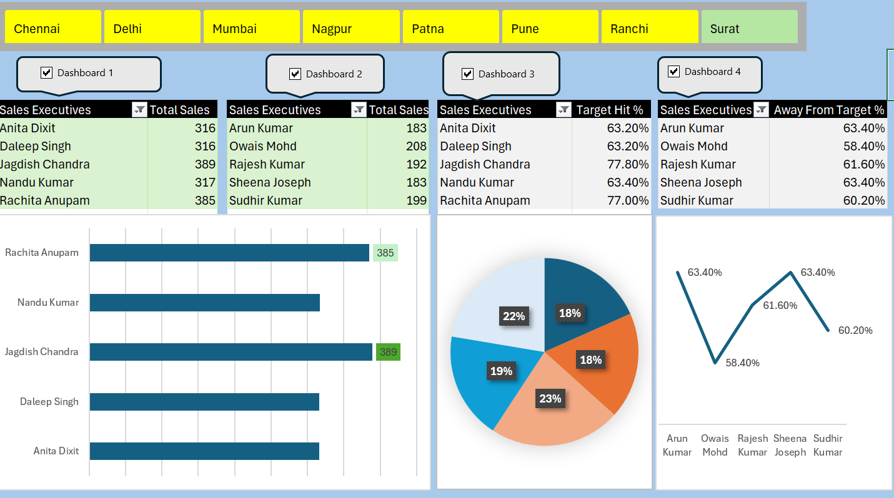

# Sales Executive Target Tracker (Excel)

Macro-enabled Excel dashboard tracking 5-day sales performance by executive and region.

## Dashboard Preview

## Project Overview

This project tracks daily sales performance for a team of sales executives across multiple regions, including Chennai, Delhi, Mumbai, Nagpur, Patna, Pune, Ranchi, and Surat.

The dashboard consolidates five days of sales data into key performance metrics, allowing users to compare sales performance, target achievement, and remaining gaps across executives and regions.

## My Process

- Structured daily sales data (Day1–Day5) by employee code, sales executive, and region
- Calculated Total Sales, Target Hit %, and Away From Target %
- Created PivotTables to summarize sales and target performance
- Built interactive dashboard views for comparing executive performance
- Added a Region slicer for dynamic filtering
- Used VBA through the `SlicerConnection` macro to control slicer-to-PivotTable connections across dashboard views

## Key Insights

- Sales performance varies across executives, with clear differences in total sales achieved
- Target achievement levels vary considerably across the team
- Comparing Target Hit % with Away From Target % helps identify executives who are closer to or further from their sales targets
- Regional filtering enables performance to be reviewed for different geographic teams

## Features

- Interactive Region filtering
- Five-day sales tracking by executive
- Automatic Total Sales calculation
- Target Hit % and Away From Target % KPIs
- PivotTable-based performance summaries
- Multiple dashboard views
- VBA-controlled slicer-to-PivotTable connections

## Files

- `Sales Executive Target Tracker.xlsm` – macro-enabled workbook containing the source data, PivotTables, dashboard, slicer, charts, and VBA functionality

## How to Use

1. Download `Sales Executive Target Tracker.xlsm`
2. Open the workbook in Microsoft Excel
3. Click **Enable Content** to allow the VBA functionality
4. Use the Region slicer to filter dashboard results
5. Use the Dashboard controls to switch or manage dashboard interactions
6. Update the source data if required
7. Select **Data → Refresh All** to refresh the PivotTables

## Tools & Skills Used

- Microsoft Excel
- PivotTables
- PivotCharts
- Slicers
- VBA
- Data Aggregation
- KPI Calculation
- Sales Performance Analysis
- Dashboard Design

## Requirements

Microsoft Excel desktop is required. Macros must be enabled for the VBA-controlled functionality.
